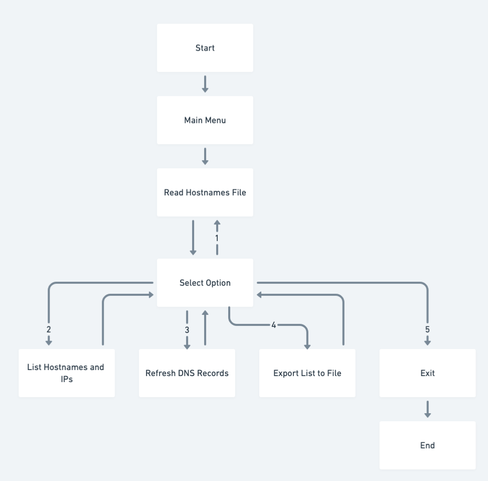
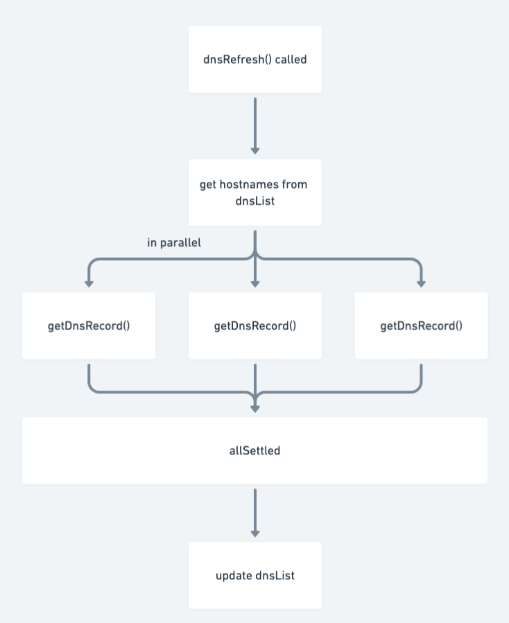

# dns-refresh-test

This is a CLI program developed as part of an interview test. It allows users to input and manage a list of hostnames, view associated IP addresses, perform DNS refresh operations, and export the results to a JSON file.

## Features

1. **Input a List of Hostnames**: Read hostnames from a JSON file (`hostnames.json` by default) and load them into the program.
2. **List Hostnames with IPs**: Display the hostnames and their associated IPs in an organized format.
3. **Perform a DNS Refresh**: Refresh the DNS records for each hostname and update the IP status.
4. **Export to File**: Save the list of hostnames with their current IP statuses to an export file.
5. **Load Custom JSON Input Files**: Option to load hostnames from a custom JSON file.

## Prerequisites

- **Node.js**: Ensure that Node.js is installed on your machine to run this program. You can download it from [https://nodejs.org/](https://nodejs.org/).

## Installation and Running the Program

1. **Clone the Repository**: 
   ```bash
   git clone https://github.com/djolf/dns-refresh-test.git
   ```
2. **Navigate to the Folder**:
   ```bash
   cd dns-refresh-test
   ```
3. **Install Dependencies**:
   ```bash
   npm install
   ```
4. **Run the Program**:
   ```bash
   npm start
   ```

## Initialization

Upon starting, the program initializes with the following top 5 most-visited domains:

- `google.com`
- `youtube.com`
- `facebook.com`
- `wikipedia.org`
- `instagram.com`

To use a custom list of hostnames, you can edit the `hostnames.json` file. The JSON structure should be a simple array of hostnames:

```json
[
  "google.com",
  "youtube.com",
  "facebook.com",
  "wikipedia.org",
  "instagram.com"
  // feel free to remove or add more 
]
```

## Usage

After running `npm start`, you will see a menu with the following options:

1. **Read Hostnames File**: Load hostnames from the default JSON file (`hostnames.json`) or a custom file.
2. **List Hostnames with IPs**: Display each hostname and its associated IP addresses.
3. **Perform a DNS Refresh**: Update IP information for each hostname and mark outdated IPs as "HANGING."
4. **Export List to File**: Save the current list of hostnames with their IP statuses to a JSON file in the `exported` directory.
5. **Exit**: Exit the program.

The following flowchart illustrates the program flow:



### DNS Refresh Asynchronous Flow

The DNS refresh function (`dnsRefresh()`) retrieves DNS records for each hostname in parallel, updating the `dnsList` once all requests are completed. 



### Loading a Custom JSON Input File

When selecting the “Read Hostnames File” option, the program will prompt you to enter a filename for the input file. 

- If you provide a custom filename, it will load hostnames from that specified file (e.g., `my_custom_hostnames.json`).
- If you leave the filename blank, the program will default to using `hostnames.json`.

This feature enables flexibility to load different sets of hostnames as needed, without modifying the default input file.

### Exporting Results

The program will export results to a JSON file in the `exported` directory with the filename specified during export (e.g., `exported_hostnames.json`).

## Testing

This project uses Jest for testing. The interactive portion of the program (`mainMenu`) does not run when Jest is running, allowing Jest to test each function independently.

### Running Tests

To run tests, use:

```bash
npm test
```

Tests cover individual functions, including reading hostnames from a file, refreshing DNS records, and exporting results to a file.
